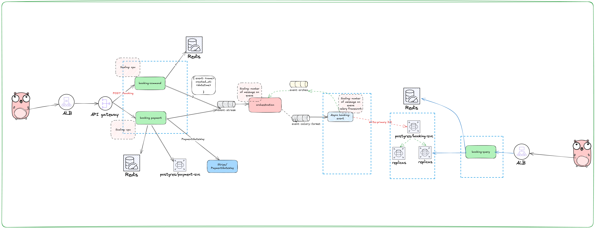

# LI - TEST

> Please make sure that, your computer has make, docker, docker-compose tool

## Architecture



## Explain

# LI - TEST

> Please make sure that, your computer has make, docker, docker-compose tool

## Architecture


## Purpose

Booking service has high traffic for write and read. It should be scalable and fault tolerant.

> CQRS pattern is used to separate read and write operations.

- Write: POST /bookings: Create a booking
  High traffic, high write, low read: Redis for 1st db -> event driven -> Postgres for 2nd db
  Auto scaling: Kubernetes, base on CPU usage

```json
{
  "slot_id": 1
}
```

- Read: GET /bookings: Get all bookings
  High traffic, high read, low write: Postgres replica for read
  Auto scaling: Kubernetes, base on CPU usage

- Service Payment: POST /payments: Create a payment
  Consistency: ACID transaction and DI/IoC for payment service to easy to replace
  new payment service

## Run project

```bash
make start
```

## Clean project

```bash
make clean
```
